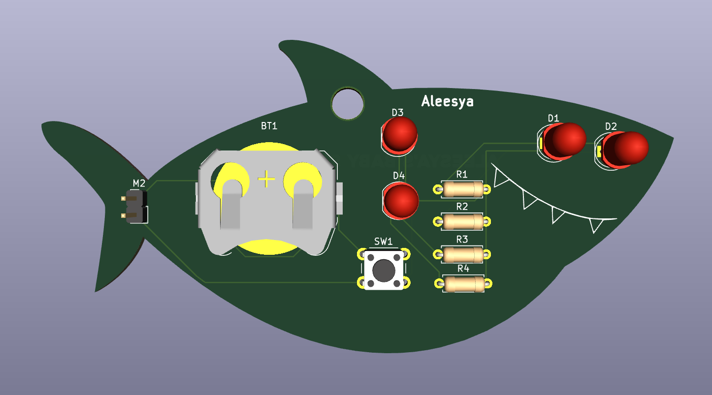
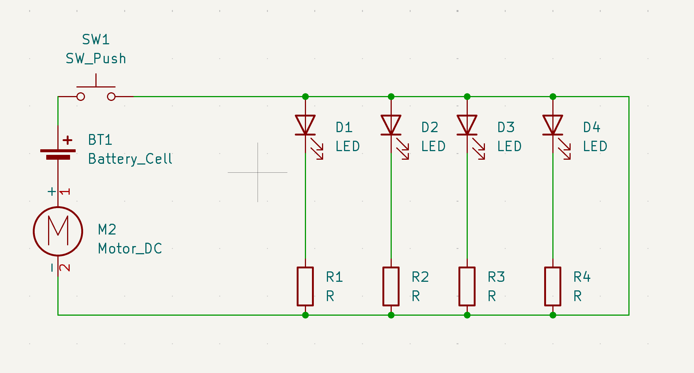

# BabySharkSolder

This project is a keychain baby shark! It's made for my baby sister since because that's her favourite cartoon

BOM 
- 4x LED's
- 4x Resistors
- 1x Battery cell
- 1x Motor DC
- 1x SW_PUSH

By FlameBamboo
